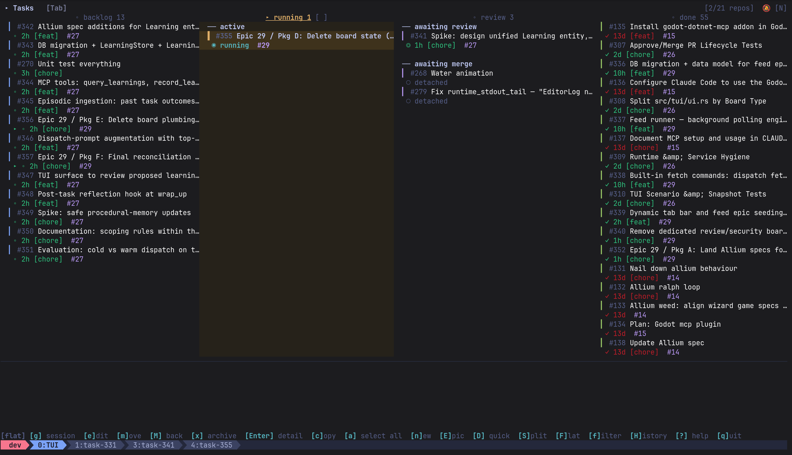
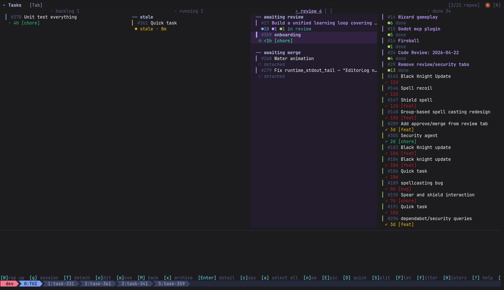
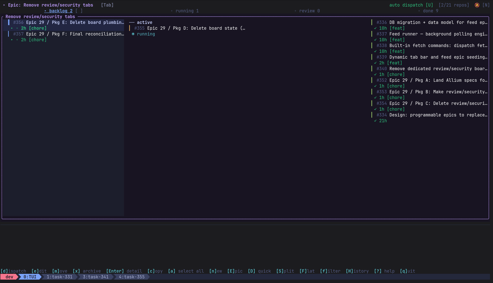

# Dispatch

A terminal kanban board for dispatching and monitoring Claude Code agents — each in its own git worktree and tmux window.



## What you get

- **Kanban board** — track agents from Backlog → Running → Review → Done, auto-updated as they work
- **Isolated worktrees** — each agent gets its own git branch, keeping your working tree clean
- **Epics** — chain agents in sequence: a planner writes the spec, the rest implement it
- **Split pane** — press `S` to watch an agent work side-by-side with the board
- **Agent coordination** — agents create subtasks, message each other, and trigger the next task in a chain

<table>
<tr>
<td><br/><b>Kanban</b> — tasks and epics side by side</td>
<td><br/><b>Epics</b> — subtasks dispatched in sequence</td>
</tr>
</table>

## Why Dispatch?

Most agent managers are session managers — they open a terminal and let you watch agents run. Dispatch is a workflow tool: tasks move through a kanban board, agents report their own status back via MCP hooks, and epics let one planning agent decompose work that a sequence of agents then implement.

- **Structured work, not just open terminals** — every agent has a task, a status, and optionally a plan
- **Agents drive the board** — hooks fire when an agent starts, finishes, or waits for input; no manual status updates
- **Epics as orchestration** — a planner writes a spec, dispatch queues the subtasks, agents implement them in order
- **MCP server built in** — agents can create tasks, message each other, and trigger the next task in a chain

## Prerequisites

| Dependency | Required | Install |
|---|---|---|
| Rust toolchain | Yes | [rustup.rs](https://rustup.rs) |
| `tmux` | Yes | `apt install tmux` / `brew install tmux` |
| `git` | Yes | Already installed on most systems |
| `claude` | Yes | [Claude Code CLI](https://claude.ai/code) |
| `gh` | Optional | [GitHub CLI](https://cli.github.com) — needed for PR operations |

## Getting Started

**1. Clone and install:**

```bash
git clone https://github.com/Ragazoor/dispatch-tui
cd dispatch-tui
cargo install --path .
```

**2. Configure Claude Code:**

```bash
dispatch setup
```

This registers the dispatch MCP server, installs the dispatch plugin (hooks, skills, commands), adds MCP tool permissions, and enables tmux `focus-events` (needed for the split-view focus indicator).

**3. Open a tmux session** (dispatch must run inside tmux):

```bash
tmux new-session -s dev
```

**4. Start the TUI:**

```bash
dispatch tui
```

You're ready — press `n` to create your first task and `d` to dispatch it.

## Usage

**Create a task (`n`)** — enter a title, description, tag (`b`=bug, `f`=feature, `c`=chore, `e`=epic), and a repo path. Press `d` to dispatch: a Claude Code agent opens in a tmux window and, depending on the tag, writes a plan before implementing. When the agent moves the task to Review, press `W` to rebase onto main or open a draft PR — or type `/wrap-up` in the agent's session to commit any pending work and do the same.

**Quick dispatch (`D`)** — skip the form entirely. Pick a repo (if more than one is configured) and the agent dispatches immediately with a placeholder title; it renames the task itself after learning what you want.

**Epics (`E`)** — group related work under an epic. The first `d` creates a planning subtask whose agent writes an implementation plan broken into subtasks; each subsequent `d` dispatches the next Backlog subtask in order.

**Navigation** — `g` jumps to the selected agent's tmux window, `S` opens a side-by-side split with the TUI on the left and the agent pane on the right.

Full key bindings and configuration options are in [docs/reference.md](docs/reference.md).

## Key Concepts

**Tasks** — the unit of work. Each task has a title, description, status, and optionally a plan and a linked git repo.

**Tags** — optional labels (`b`=bug, `f`=feature, `c`=chore, `e`=epic) chosen during task creation that control what happens when you press `d`:

| Tag | No plan | Has plan |
|-----|---------|----------|
| `epic` | Brainstorm (explore and ideate, no code edits) | Dispatch |
| `feature` | Plan (write implementation plan, no code edits) | Dispatch |
| `bug`, `chore`, none | Dispatch | Dispatch |

**Plans** — markdown files describing what an agent should build. A task with a plan always dispatches directly regardless of tag.

**Kanban columns:** Backlog → Running → Review → Done

- **Backlog** — tasks ready to be dispatched (`▸` = has a plan)
- **Running** — agent is active in a tmux window
- **Review** — agent finished; awaiting your review
- **Done** — merged and wrapped up

**Worktrees** — each dispatched agent gets its own git worktree at `<repo>/.worktrees/<id>-<slug>`, isolating agent work from your main branch. Closing the tmux window does **not** delete the worktree — press `d` again to resume.

**Split view** — press `S` to enter side-by-side mode: the TUI on the left, the selected agent's tmux pane on the right. Press `G` to pin a different task in the right pane, or `g` to jump directly to an agent window (leaving split view). A colored border shows which pane has focus (cyan = TUI, dim = agent). Requires tmux `focus-events` — enabled automatically by `dispatch setup`.

**Epics** — a group of related tasks. Press `g` on an epic to see its subtasks. Press `d` on the epic to dispatch the next Backlog subtask automatically. Epics can be nested — an epic subtask can itself be an epic.

## Agentic patterns

Dispatch agents can coordinate with each other through the MCP server:

**Spawning subtasks** — an agent can create a new task on the board with `create_task`, useful when it discovers work that should be tracked separately or handed off to another agent.

**Agent-to-agent messaging** — `send_message` delivers a prompt directly into another running agent's tmux window. Fire-and-forget: the sender doesn't wait for a response. Useful for passing context or unblocking a dependent agent.

**Epic as orchestration** — an epic planning agent writes an implementation plan with subtasks, then each subtask is dispatched in sequence. Agents can call `dispatch_next` to trigger the next subtask themselves once their own work is complete.

## Learn More

- **[Reference](docs/reference.md)** — key bindings, configuration, CLI usage, troubleshooting
- **[CLAUDE.md](CLAUDE.md)** — architecture, testing patterns, contribution guidelines

## License

[MIT](LICENSE)
