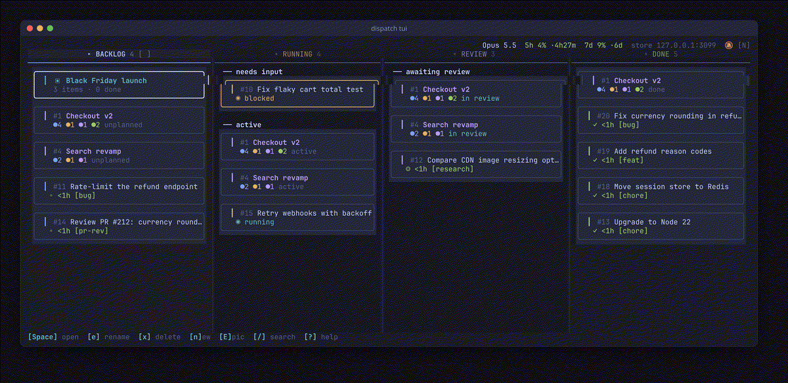
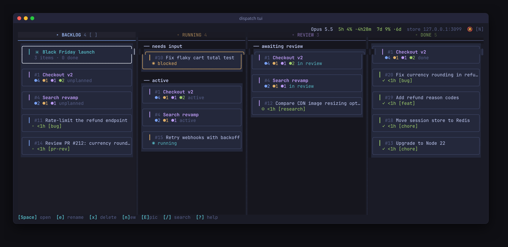
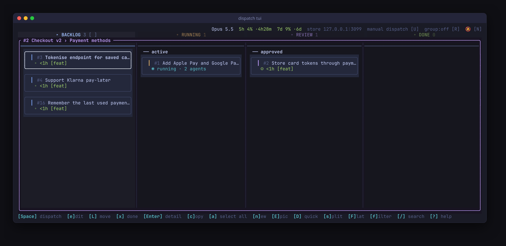
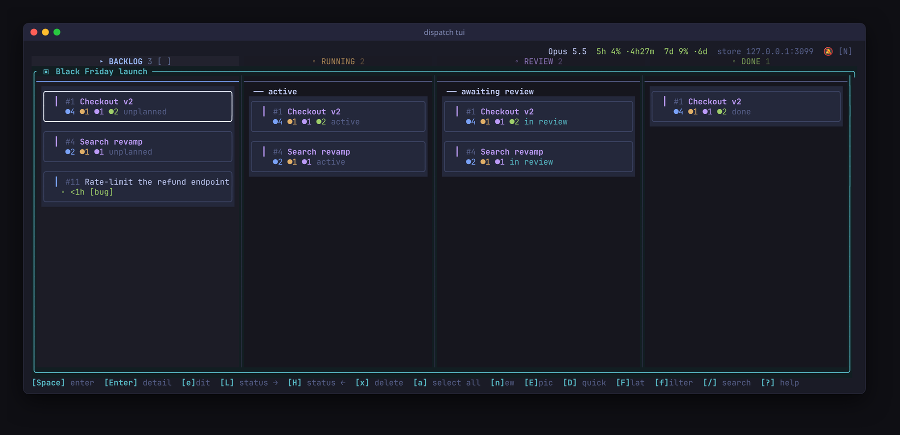

# Dispatch

A terminal kanban board that runs Claude Code agents. Each agent gets its own git worktree and tmux window.

<!-- The images below come from a made-up demo project. Regenerate them with scripts/readme-demo/run.sh. -->


**[Try it in your browser →](https://ragazoor.github.io/dispatch-tui/guide/)** A playable tour of the board, epics and work packages. Nothing to install.

## Why

Most agent managers are session managers: they open a terminal and let you watch. Dispatch is a workflow tool.

- **Every agent has a task** — a title, a status, a repo, and often a plan
- **Agents move their own cards** — hooks report start, finish, and blocked; you never set a status by hand
- **Work is isolated** — one worktree and one branch per agent, so your checkout stays clean
- **Agents coordinate** — an MCP server lets them create tasks, read the knowledge base, and chain the next one

## A look around

**The board.** Each column shows what needs you first. Running cards are grouped by what the agent is doing: *needs input* at the top, then *active*. Review cards are grouped by where the work is: *changes requested*, *approved*, then *awaiting review*.



**Epics nest.** An epic card shows how its work is spread across the columns. Press `Space` to step inside; the breadcrumb shows how deep you are. Inside, a card can be another epic or a task. Here, an agent on #1 runs two subagents of its own while #2 waits in Review, approved.



**Work packages cut across epics.** A package gathers the epics and tasks behind one goal, such as a launch, wherever they live on the board. `Space` opens it as its own board.



## Requirements

| Tool | | Install |
|---|---|---|
| Rust | required | [rustup.rs](https://rustup.rs) |
| `tmux` | required | `dnf install tmux` / `brew install tmux` |
| `git` | required | usually already there |
| `claude` | required | [Claude Code CLI](https://claude.ai/code) |
| `gh` | optional | [GitHub CLI](https://cli.github.com), for pull requests |

## Install

```bash
git clone https://github.com/Ragazoor/dispatch-tui
cd dispatch-tui
cargo install --path .
dispatch tui
```

The board lives in a SpacetimeDB store.

- **Working alone:** install the [`spacetime` CLI](https://spacetimedb.com/install). That is all. `dispatch tui` starts a local store on `127.0.0.1:3000`, publishes its module, and stops it when the board exits.
- **In a team:** point every board at a shared store: `export DISPATCH_SPACETIME_SERVER=http://team-store:3000`

That is the whole install. If you are not already in tmux, `dispatch tui` starts a session named `dispatch` for itself. Before the board draws, it offers to register the MCP server, plugin and tmux settings. It asks only when something is out of date, so re-run it after an upgrade to stay current.

Run it again later and it restarts the board in the same session. The old board's window closes and a fresh one takes its place. The agent windows beside it keep running.

## Your first task

1. Press `n` and fill in a title, a description, and a repo path.
2. Press `Space`. Dispatch cuts a worktree, opens a tmux window, and starts an agent there.
3. Watch it work: `s` splits the screen, board on the left and agent on the right.
4. The agent moves itself to Review when it is done. Type `/wrap-up` in its session to commit and either rebase onto the base branch or open a draft pull request.

In a hurry? Press `D` instead. It skips the form, dispatches at once, and the agent names the task itself.

## How it works

**Columns** — Backlog → Running → Review → Done. `Space` is the one action key: it dispatches a Backlog task, and jumps to or resumes a Running one.

**Worktrees** — each agent works in `<repo>/.worktrees/<id>-<slug>`. Closing the tmux window keeps the worktree, so `Space` resumes where the agent left off.

**Plans** — a markdown file describing what to build. Attach one and the agent implements it directly instead of designing first.

**Tags** — labels such as `bug`, `feature`, `chore`, `research`, `pr-review`. Most are just labels. Two change behaviour: `research` launches a research agent, and `pr-review` skips the design step and, given a PR link, cuts the worktree from that PR's branch.

**Epics** — a group of tasks that run in order. Epics can hold other epics. `Space` on an epic card steps inside; `q` steps back out one level and `Q` returns to the board. Inside an epic, turn on auto-dispatch (`U`) and finishing one subtask starts the next, so each worktree is cut from a branch that already holds its predecessor's work.

**Work packages** — a set of epics and tasks that serve one goal. `w` links the selected card to a package; `Space` on a package card opens it.

**Knowledge base** — agents record what they learn. Dispatch injects the relevant entries into the next agent's prompt.

**Feeds** — a shell command that pulls work onto the board on a schedule, such as open pull requests or CVE alerts.

## Docs

- [Guided tour](docs/guide/index.html) — try the board in your browser
- [Reference](docs/reference.md) — key bindings, configuration, CLI, feeds, troubleshooting
- [MCP](docs/mcp.md) — the tools agents call
- [Specs](docs/specs/) — what the system is meant to do
- [CLAUDE.md](CLAUDE.md) — building, testing, and contributing

## License

[MIT](LICENSE)
