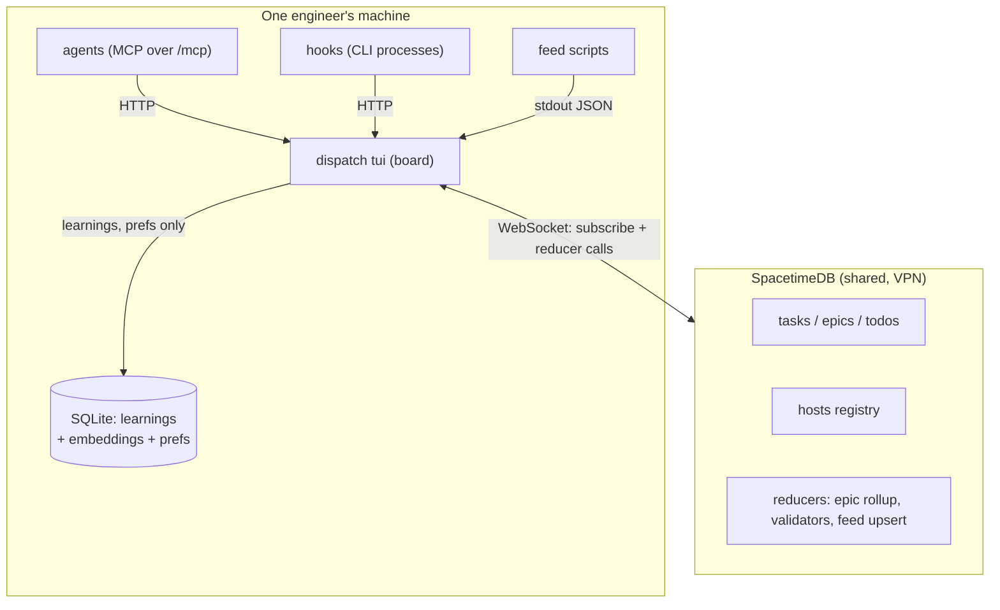

# Migrating dispatch to SpacetimeDB as the shared store

**Status:** proposed — supersedes the SpacetimeDB verdict in
[2026-09-13-distributed-dispatch-design.md](2026-09-13-distributed-dispatch-design.md),
whose ownership and host-gating design still stands.
**Task:** #4855, epic #325 (SpacetimeDB)
**Decision owner:** ragge
**Date:** 2026-09-17

## TL;DR

Dispatch's board is one SQLite file on one machine, so a team cannot share it.
The 2026-09-13 evaluation rejected SpacetimeDB on four grounds; three of them
rested on an offline-first requirement that has since been retired, because
dispatching an agent needs the network anyway.

Re-evaluated, SpacetimeDB becomes the authoritative store for the shared domain
— tasks, epics, todos, watchers, live agent state, host registry. SQLite stays
only for what SpacetimeDB cannot hold: the knowledge base, which needs a vector
index, and local UI preferences.

> The one rule: **a shared table has exactly one copy.** SpacetimeDB holds it,
> or nothing does. No local mirror, no write-through cache, no second schema.

That single constraint is what removes dirty rows, conflict resolution, id block
allocation and the merge-two-installs problem from the design — all of which the
previous design carried as unsolved.

**Ask:** approve this shape, or push back on the partition, so the implementation
plan can be written against it.

## Problem

Dispatch state lives in one SQLite file (`src/db/mod.rs`). Nothing in the crate
knows which machine a task belongs to, beyond the host identity that landed in
`bf034d4f`. Several engineers each run their own board, with independent
histories that both start at task id 1.

The desired end state, settled across this session and the last:

- Several people on a team share one board.
- Each person's agents run locally, in local worktrees and local tmux windows.
- A task belongs to an **epic** or to a **user board**. You subscribe to your
  own user board and to any number of epics.
- For a teammate's dispatched task you see status, not a way to launch onto
  their machine.

The tension: dispatch's real work is subprocesses on a specific laptop — `git
worktree add`, tmux, `claude`, `gh` — while its *state* wants to be one shared
thing. Any design has to split those cleanly.

### Why the previous verdict does not hold

The earlier evaluation's four findings, re-judged:

| Finding | Verdict now | Why |
| --- | --- | --- |
| Module cannot spawn subprocesses | **Dropped** | Mis-scoped. Dispatch is a *client*. It keeps doing subprocesses locally and writes rows over a socket. Nothing asked reducers to run `git`. |
| No offline support in the Rust SDK | **Dropped** | Offline is retired as a requirement. The residual — no auto-reconnect — is a day of work, not a blocker. |
| Standalone is single-node | **Dropped** | Only mattered because offline demanded a local replica per laptop. One shared server is now the architecture. |
| Migrations are append-only | **Stands** | See below. The only surviving objection. |

Two further objections were raised in review and resolved:

- **Hook processes.** Every Claude Code hook spawns its own short-lived
  `dispatch` CLI process that opens the DB directly
  (`src/main.rs::open_hook_service`). Opening a WebSocket per hook would be a
  hot-path round trip. Resolved: the board already runs an Axum server serving
  `/mcp` (`src/mcp/mod.rs`), started only by the TUI runtime
  (`src/runtime/mod.rs`), and every agent MCP call already goes through it.
  Hooks route there too and reuse its connection.
- **96 SQLite schema versions.** Not migrated. SpacetimeDB starts at the current
  schema as its version 1.

### The surviving cost: forward migrations

Verified against SpacetimeDB docs on 2026-09-17.

Automigrates: new tables, new indexes, `Auto Inc` on or off, private to public,
new reducers, removing `Unique`.

Forbidden: removing tables, removing or modifying any existing column, adding a
column without a default, adding a column anywhere but the end, adding `Unique`
or `Primary Key`.

There is **no export, import, dump or restore**. `--delete-data` is marked
development-only. So a forbidden change costs either the incremental-migration
pattern (duplicate table, dual writes, staged rollout) or a hand-written
dump-and-reload through the client SDK.

Dispatch's own history says this is a steady minority, not a rarity. Counting
`src/db/migrations.rs`: 57 `ADD COLUMN` against 13 `DROP COLUMN`, 26 renames, 19
`DROP TABLE` and 40 lines touching rebuild tables.

**Stance: accepted.** Mitigated by writing a dump/restore client early (Phase 0)
so the escape hatch exists before it is needed.

## Goals

- One shared board across several machines and several people.
- The board draws from a local cache when the server is unreachable, read-only.
- A task's worktree, tmux window and running agent stay pinned to one machine,
  and only that machine can act on them.
- Feed scripts keep running locally, against local `gh` credentials.

## Non-goals

- **Working offline.** Dispatching an agent needs the network. Writes fail when
  the server is down; they are not queued.
- **Drawing the board on a cold start while the server is down.** A persistent
  local mirror would buy only that one case, at the cost of a second copy of the
  task schema kept in step forever. A board you cannot write to is close to
  useless anyway. While the board is *already running*, the SpacetimeDB client
  cache is in memory, so a mid-session disconnect degrades to read-only for
  free.
- **Permissions.** Anyone authenticated may read and write any epic. Subscription
  is a view filter, not a security boundary. Revisit when there is something
  concrete to restrict.
- **Shipping agent logs and trajectories** between machines. Separate data path,
  separate size and privacy questions.
- **Sharing the knowledge base.** Semantic search needs a vector index. Learnings
  and their embeddings stay local.
- **Migrating existing task history.** See Open questions.

## Decision

1. SpacetimeDB is the authoritative store for the shared domain. One
   self-hosted Standalone instance, reachable over the company VPN.
2. SQLite stays only for what SpacetimeDB cannot hold — the knowledge base with
   its embeddings, and local UI preferences. It holds no copy of any shared
   table.
3. The board holds the only SpacetimeDB connection on a machine. Hooks and CLI
   subcommands stop opening the database and call the board's local HTTP server
   instead.
4. Identity is two-level. A **user identity** (SpacetimeDB Identity) owns user
   boards and epics. A **host id** — already landed in `bf034d4f` — owns
   worktrees. One person has several hosts.
5. Subscriptions define what syncs: your own user board, plus every epic you
   subscribe to.
6. Logic that needs the whole picture moves into reducers. Everything that
   touches the local disk stays in the dispatch binary.
7. **The server is seeded from one existing board** — ragge's — with task and
   epic ids preserved. Every other install starts from that seed; their local
   histories are not merged. This is what makes the id-space collision between
   existing installs a non-problem rather than an unsolved one.

### Why this shape

**One writer per machine.** The board is the only process holding a
SpacetimeDB connection. That is not a new constraint — agents already cannot work
without the board, because it serves `/mcp`. Extending it to hooks removes the
cross-process SQLite races that `docs/conventions.md` documents, including the
counter desync in task #3755.

**One copy, so there is nothing to reconcile.** No dirty flags, no `synced_at`,
no push protocol, no last-writer-wins rules — and no second schema to keep in
step on every change.

**Ids come from the server.** `Auto Inc` in SpacetimeDB is globally unique by
construction. No Hi/Lo block allocation, no gaps, no change to the
`COALESCE(sort_order, id)` board ordering that block allocation would have
broken.

**Epic status stops flapping.** The previous design identified
`recalculate_epic_status` as the one piece of logic that must see all subtasks.
A reducer sees them.

## Table partition

14 real tables today. Four more — `my_prs`, `review_prs`, `bot_prs`,
`security_alerts` — exist only in migration history and are referenced by no
code outside `src/db/migrations.rs`. They are legacy of the removed Review and
Security boards, whose behaviour `feeds.allium` records as subsumed by feed
epics. They are not recreated.

| Table | Home | Note |
| --- | --- | --- |
| `tasks` | SpacetimeDB | Gains `owner` (user identity) for epic-less user-board tasks. Keeps `host`. |
| `epics` | SpacetimeDB | Status derived by reducer. |
| `todos` | SpacetimeDB | |
| `task_watchers` | SpacetimeDB | Cross-host nudge still unsolved — see Open questions. |
| `task_shells` | SpacetimeDB | Live status a teammate wants to see. Owning host is sole writer. |
| `task_subagents` | SpacetimeDB | As above. |
| `repo_base_branches` | SpacetimeDB | Shared repo config. |
| `hosts` | SpacetimeDB | New. Registry of host id plus editable label. |
| `subscriptions` | SpacetimeDB | New. Which epics a user follows. |
| `task_usage`, `usage_events` | Undecided | High churn, per-task cost. Defaulting to local for v1. |
| `learnings`, `learning_retrievals`, `learning_verdicts` | SQLite | Semantic search needs a vector index. |
| `repo_paths` | SpacetimeDB | Shared repo config, alongside `repo_base_branches` which keys off it. |
| `settings` | Split | Port and per-install paths stay local. Host id does **not**: it is a `hosts` row (see above), which SQLite happens to back with `settings` keys. Corrected 2026-09-18 in task #4861 — the earlier wording contradicted the `hosts` row in this same table. |
| `filter_presets` | SQLite | Per-person UI preference. |

## Reducers

Server-side only where the server is the only thing that can do the job.

| Logic | Where | Why |
| --- | --- | --- |
| `recalculate_epic_status` | Reducer | Needs every subtask, which spans hosts. |
| Task and epic validators | Reducer | Invariants must hold whoever writes. |
| Feed upsert | Reducer | Called by the owning host; status-preservation rules stay in one place. |
| Id assignment | Reducer (`Auto Inc`) | Global uniqueness. |
| `TaskService::dispatch` | Local | Spawns `git`, tmux, `claude`. |
| Worktree provisioning and release | Local | Touches this disk. |
| PR polling | Local, host-scoped | Needs local `gh` auth. Scope to the owning host so two boards do not race the retry counters. |
| Feed script execution | Local | Needs local `gh` auth. |

## Seeding

The Phase 0 dump/restore tool does double duty: it is the backup, the escape
hatch from a forbidden migration, and the one-time seeding tool.

Seeding preserves ids, which needs care. Verified against the SpacetimeDB docs
on 2026-09-17:

> `Auto Inc` assigns a value **only when the column is zero**. Inserting an
> explicit non-zero id does not advance the sequence.

So a naive seed leaves the counter at 1 and the next created task collides with
the oldest seeded one. There is no "set sequence" call. The seeding reducer must
burn the counter by inserting and deleting throwaway rows with id 0 until the
generated value passes the highest seeded id.

> **Corrected 2026-09-17, while building Phase 0.** This paragraph originally
> said to burn *after* loading, and said block pre-allocation made the loop
> cheap. Both were wrong, and both were checked against a live SpacetimeDB
> 2.10.1 instance:
>
> - **The burn must run BEFORE the rows are loaded.** It asks the store to
>   generate ids 1, 2, 3 — precisely the ids a seed is about to write. Against a
>   loaded table every one of those inserts violates the primary key and the
>   reducer aborts. There is no way to advance the counter past a row without
>   generating that row's id, so burning a loaded table is not slow, it is
>   impossible.
> - **Pre-allocation does not shorten the loop.** It is one insert and one
>   delete per id. That is still cheap — burning past 4096 took 29 ms — but for
>   a different reason: it runs once, server-side, inside one transaction.
>
> `docs/specs/spacetime-seed.allium` is the authority; see its `BurnIdSequences`
> rule. Sequences are allowed gaps, so the seed remains safe and runs once.

Two backfills happen at seed time:

- **`Task.owner`.** Every epic-less task becomes a user-board task owned by the
  seeding user.
- **`Task.host`.** Already correct — `bf034d4f` stamps it when a worktree is
  provisioned, so seeded tasks carry the seeding machine's host id.

## Risks and trade-offs

| Risk | Stance |
| --- | --- |
| Forbidden schema changes need the incremental pattern, with no dump tool | **Accepted.** Mitigated by building dump/restore in Phase 0, before it is needed. |
| Server down means no writes | **Accepted**, deliberately. Read-only stale board is the agreed behaviour. |
| Server is a single point of failure for the whole team | **Open.** Standalone has no replication. Backups depend on the Phase 0 dump tool. |
| ~3.7k lines of query code rewritten | **Accepted.** `tasks.rs` alone is 1.2k. Phased, behind the existing store traits. |
| Rust SDK has no auto-reconnect | **Mitigated.** Write the reconnect loop; surface disconnection in the board. |
| Seeding preserves ids but not the sequence counter | **Mitigated.** Seeding reducer burns the counter past the highest seeded id. Covered by a test that creates a task immediately after a seed. |
| Teammates lose their existing local boards at cut-over | **Accepted**, decided 2026-09-17. Only one board seeds the server. |
| BSL licence travels into the dispatch binary | **Accepted** while dispatch stays internal. Revisit before any external distribution. |
| Cold start needs a subscription round trip before the board draws | **Resolved in Phase 4: it does not.** The board draws first and connects after (`sync.allium: OpenBoardConnection`), so a cold start pays nothing. The round trip itself measured 4–44 ms. See "Cold start, measured" below. |
| A cold start with the server down cannot draw at all | **Accepted.** See non-goals. |

## Alternatives considered

| Alternative | Verdict | Why |
| --- | --- | --- |
| SQLite primary, SpacetimeDB as a mirror (the 2026-09-13 design) | **No** | Keeps dirty rows, id blocks, the merge problem and a second schema. More machinery for less. |
| Dispatch's existing Axum server as the shared transport | **No** | One schema and no new dependency, but you hand-write the push channel, auth, subscriptions and identity — all of which SpacetimeDB supplies. |
| Postgres with LISTEN/NOTIFY | **Not evaluated** | Plausible and boring. Worth one paragraph of rebuttal if a reviewer raises it. |
| Keep SQLite, no sharing | **No** | Does not meet the goal. |

## Plan

Phases, each independently useful. Sequence matters.

| # | Phase | Description |
| --- | --- | --- |
| 0 | Dump and restore | A client that reads every shared table to JSON and writes it back, preserving ids and burning the sequence counter afterwards. Built first: it is the backup, the escape from a forbidden migration, and the seeding tool. |
| 1 | Module and schema | SpacetimeDB module with the shared tables at version 1. No dispatch changes yet. |
| 2 | Single connection | Hooks and CLI subcommands stop opening SQLite and call the board's HTTP server. Pure refactor, testable today, valuable on its own. |
| 3 | Store seam | Put the shared tables behind the existing `*Store` traits so the backend can swap. |
| 4 | Identity and subscriptions | User identity, host registry, subscription table, and the board's connect and reconnect loop. |
| 5 | Cut over reads | Board reads from the SpacetimeDB subscription instead of SQLite. |
| 6 | Cut over writes | Mutations become reducer calls. `recalculate_epic_status` moves server-side. |
| 7 | Host-scope polling | `PollPrStatus` and feed runs scoped to the owning host. |
| 8 | Retire dead tables | Drop the four legacy PR tables and the SQLite tables now owned by SpacetimeDB. |

Phases 0 to 3 touch no behaviour a user sees and can land before the server
exists.

## Open questions

1. **`task_usage` and `usage_events`** — shared for team cost visibility, or
   local because they churn?
2. **Cross-host task watchers.** `src/service/tasks/watchers.rs` nudges a tmux
   pane. Tmux is per-machine, so a watcher on another host silently finds
   nothing. Unsolved.
3. **Server hosting and backup.** Which box, who operates it, how often the
   Phase 0 dump runs.
4. **Learning text.** The stated blocker is the vector index, which affects
   embeddings only. Syncing learning *text* and recomputing embeddings per
   machine stays possible. Deferred, not refused.

## References

- [Automatic Migrations, SpacetimeDB docs](https://spacetimedb.com/docs/databases/automatic-migrations/) — verified 2026-09-17
- [incr-migration-demo](https://github.com/clockworklabs/incr-migration-demo)
- [2026-09-13-distributed-dispatch-design.md](2026-09-13-distributed-dispatch-design.md) — ownership model and host gating, still current
- `docs/specs/feeds.allium` — feed epics subsume the removed Review and Security boards

## Cold start, measured

Phase 4 was asked to find out what the design's accepted round trip costs.
The answer is that it costs nothing, for a reason that turned out to matter
more than the number.

**The board does not wait for the connection.** `sync.allium`'s
`OpenBoardConnection` fires on `BoardDrawn` — the board is already on screen
when the first attempt is made, and it spends its first moments in
`connecting`, drawing from the local store exactly as it always has. Blocking
the start on a round trip would have made every cold start as slow as the
slowest network the board had ever been on, and would have made a store that is
merely *slow* indistinguishable from a board that has hung.

So the number below is the time to a live subscription, not the time to a
usable board. The second is unchanged by any of this.

### The number

Measured by `a_cold_start_reaches_a_live_subscription_promptly` in
`tests/spacetime_module.rs`, against a real standalone instance:

| | connect | subscribe | total |
|---|---|---|---|
| run 1 | 2.1 ms | 2.5 ms | 4.6 ms |
| run 2 | 1.8 ms | 41.8 ms | 43.6 ms |
| run 3 | 1.9 ms | 2.4 ms | 4.4 ms |

Connecting is consistently about 2 ms. Subscribing is usually about the same
and occasionally an order of magnitude slower — run 2 is not an outlier to
discard, it is the shape of the distribution.

### What this does not tell us

Three things, all of which make the real number larger:

- **Loopback, not a network.** No latency, no TLS handshake, no packet loss.
- **An empty database.** The subscription matched no rows, so nothing was
  transferred. A real board's initial payload is thousands of tasks, and that
  cost scales with the subscription rather than with the round trip.
- **One client.** Nothing measures a server with a dozen boards attached.

The honest conclusion is not "cold start is 4 ms". It is that the round trip
itself is small enough to be uninteresting, the payload is the part that will
matter, and neither is on the path to the board drawing — so the question the
design deferred to Phase 4 has been answered in the direction that needs no
mirror.

## What Phase 4 changed about the design

**SpacetimeDB SQL cannot filter on an optional column**, which the design did
not know. An `Option<T>` is a SATS sum type, and per the
[SQL reference](https://spacetimedb.com/docs/reference/sql/) the language
provides no way to construct one and no scalar operators for it. A subscription
is a `WHERE` clause, so the two columns the whole subscription model selects on
— `Task.owner` and `Task.epic_id` — could not be selected on at all.

Absence in the shared module is therefore a sentinel, not a null: `""` for a
string, `0` for an id reference, applied to 28 columns. See "Why almost nothing
here is `Option`" in `spacetime/module/README.md`, and
`SharedTable::sentinel_columns` for the list and the per-column reasoning.

This changes no spec. `core.allium` still has `owner: UserIdentity?` and
`epic: Epic?`, because a task really does have no epic or no owner; the
sentinel is a fact about one store's representation and is converted at that
store's boundary.

It does change the migration's economics, and phases 5 onwards should know it:
**changing a column type is not automigratable.** De-nullifying was free in
Phase 4 because no server existed. After Phase 5 seeds one, the same change
costs a dump, a rebuild and a restore.
